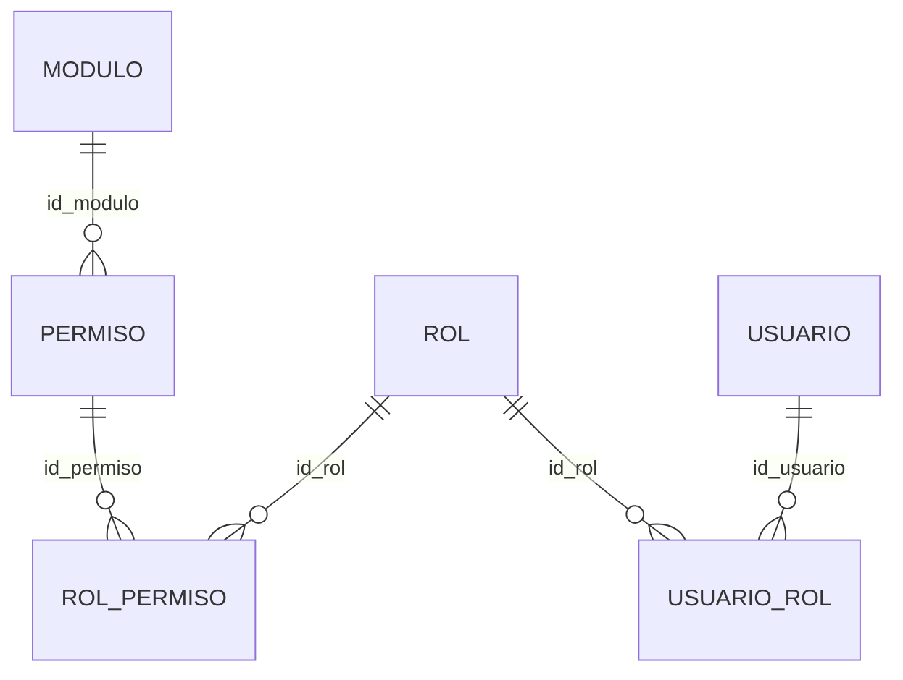

# PLAN: Backend Spring Boot — Roles y Permisos

Alcance: pestañas **Roles** y **Permisos** de [seguridad/seguridad.html](seguridad/seguridad.html). Base: PostgreSQL, script [bodega.sql](bodega.sql). Se usa `spring.jpa.hibernate.ddl-auto=validate`: nombres de tabla/columna, tipos y nulabilidad deben coincidir exactamente.

Ya existentes por el plan de usuarios ([PLAN_SEGURIDAD_BACKEND.md](PLAN_SEGURIDAD_BACKEND.md)): `AuditoriaBase`, `Rol` (mapeo básico), `UsuarioRol`, `GET /api/usuarios/roles`. Este plan completa `Rol` y agrega `Modulo`, `Permiso` y `RolPermiso`.

## 1. Grafo de relaciones



| Entidad      | Uso en pantalla                                             | Operaciones                               |
| ------------ | ----------------------------------------------------------- | ----------------------------------------- |
| `Rol`        | Pestaña Roles (tabla + modal) y columnas de la matriz       | listar, crear, editar, activar/desactivar |
| `Modulo`     | Filas de grupo de la matriz (SEGURIDAD, MANTENIMIENTO, ...) | solo lectura                              |
| `Permiso`    | Filas de la matriz (clave + nombre)                         | solo lectura                              |
| `RolPermiso` | Cada interruptor de la matriz                               | upsert de `concedido`                     |
| `UsuarioRol` | Ya definida; el rol desactivado deja de dar permisos        | sin cambios                               |

## 2. Convenciones comunes

- PK `bigserial` -> `Long` con `@GeneratedValue(strategy = GenerationType.IDENTITY)`. FK `bigint` -> `Long`.
- `timestamp` -> `LocalDateTime`; `integer` -> `Integer`.
- Todas las tablas incluyen las columnas de `AuditoriaBase`: `usu_cre`, `pc_cre`, `fec_cre`, `usu_mod`, `pc_mod`, `fec_mod` (todas nulas) y `estado` varchar(1) no nula, default `'1'`.
- `estado`: `'1'` activo, `'0'` inactivo. Desactivar es borrado lógico; no hay DELETE.
- `@ManyToOne` con `FetchType.LAZY`; exponer solo DTOs.

## 3. Entidades

### 3.1 `rol` (completar)

| Campo         | Columna       | Tipo         | Nulo | Notas                                  |
| ------------- | ------------- | ------------ | ---- | -------------------------------------- |
| `idRol`       | `id_rol`      | bigserial    | no   | PK                                     |
| `nRol`        | `n_rol`       | varchar(50)  | no   | único (`uq_rol_nombre`)                |
| `descripcion` | `descripcion` | varchar(100) | sí   |                                        |
| `nivel`       | `nivel`       | integer      | sí   | 1 Superior, 2 Operativo, 3 Restringido |
| `fCreacion`   | `f_creacion`  | timestamp    | sí   | default `CURRENT_TIMESTAMP`            |

Pantalla Roles: `#`, Rol (`n_rol`), Descripción, Nivel (badge "Nivel N" + texto: 1 Superior, 2 Operativo, 3 Restringido) y Acciones (editar, desactivar). El modal "Nuevo Rol" pide nombre (obligatorio), descripción (opcional) y nivel.

Reglas:

- `n_rol` en mayúsculas y sin espacios sobrantes. El índice único incluye roles inactivos, así que un nombre desactivado no se puede reutilizar; responder 409 con mensaje claro.
- `nivel`: validar que sea 1, 2 o 3 (la BD no tiene check).
- `f_creacion` y `fec_cre` los llena el backend si el default de BD no aplica.

### 3.2 `modulo` (solo lectura)

| Campo         | Columna       | Tipo         | Nulo    |
| ------------- | ------------- | ------------ | ------- |
| `idModulo`    | `id_modulo`   | bigserial    | no (PK) |
| `nModulo`     | `n_modulo`    | varchar(50)  | no      |
| `descripcion` | `descripcion` | varchar(100) | sí      |
| `icono`       | `icono`       | varchar(50)  | sí      |
| `orden`       | `orden`       | integer      | sí      |

Semilla (8): SEGURIDAD, MANTENIMIENTO, COMPRAS, INVENTARIO, VENTAS, CREDITOS, CAJA, REPORTES. Ordenar por `orden`.

### 3.3 `permiso` (solo lectura)

| Campo         | Columna       | Tipo         | Nulo | Notas                                          |
| ------------- | ------------- | ------------ | ---- | ---------------------------------------------- |
| `idPermiso`   | `id_permiso`  | bigserial    | no   | PK                                             |
| `modulo`      | `id_modulo`   | bigint       | no   | `@ManyToOne` -> `Modulo` (`fk_permiso_modulo`) |
| `nPermiso`    | `n_permiso`   | varchar(50)  | no   |                                                |
| `clave`       | `clave`       | varchar(50)  | no   | único (`uq_permiso_clave`), ej. `SEG_USUARIO`  |
| `descripcion` | `descripcion` | varchar(100) | sí   |                                                |

Semilla (23): `SEG_USUARIO`, `SEG_ROL`, `SEG_AUDITORIA`, `MAN_PRODUCTO`, `MAN_CATEGORIA`, `MAN_CLIENTE`, `MAN_PROVEEDOR`, `COM_REGISTRAR`, `COM_ANULAR`, `INV_STOCK`, `INV_AJUSTE`, `INV_KARDEX`, `VEN_REGISTRAR`, `VEN_ANULAR`, `VEN_DESCUENTO`, `CRE_REGISTRAR`, `CRE_COBRAR`, `CAJ_APERTURAR`, `CAJ_CERRAR`, `CAJ_MOVIMIENTO`, `REP_VENTAS`, `REP_INVENTARIO`, `REP_CAJA`. Las claves son las que consumirá el frontend y el backend para autorizar.

### 3.4 `rol_permiso`

| Campo          | Columna          | Tipo       | Nulo | Notas                                                |
| -------------- | ---------------- | ---------- | ---- | ---------------------------------------------------- |
| `idRolPermiso` | `id_rol_permiso` | bigserial  | no   | PK                                                   |
| `rol`          | `id_rol`         | bigint     | no   | `@ManyToOne` -> `Rol` (`fk_rol_permiso_rol`)         |
| `permiso`      | `id_permiso`     | bigint     | no   | `@ManyToOne` -> `Permiso` (`fk_rol_permiso_permiso`) |
| `concedido`    | `concedido`      | varchar(1) | no   | default `'1'`                                        |

Único: `(id_rol, id_permiso)` (`uq_rol_permiso`).

Semántica: un permiso está concedido a un rol solo si existe la fila con `concedido='1'` y `estado='1'`. Una fila ausente equivale a no concedido (la semilla solo inserta filas concedidas). Para guardar:

- Si no existe la fila y se concede: insertar con `concedido='1'`.
- Si existe: actualizar `concedido` (`'1'` o `'0'`) y `fec_mod`/`usu_mod`.
- Nunca borrar filas.

## 4. Pantallas y datos que necesitan

### 4.1 Roles

- Lista de roles (activos e inactivos, con `estado`) para la tabla.
- Alta y edición con el modal; el botón de la fila activa o desactiva.

### 4.2 Permisos (matriz)

- Las **columnas** son los roles activos. Hoy el HTML las tiene fijas (ADMINISTRADOR, CAJERO, ALMACENERO); deben generarse desde la API.
- Las **filas** son los permisos agrupados por módulo, ordenados por `modulo.orden` y luego por `n_permiso`; cada fila muestra la `clave` y el `n_permiso`.
- Cada celda es el `concedido` del par rol/permiso (`false` si no hay fila).
- "Guardar Permisos" envía solo las celdas modificadas.

## 5. Contrato de API propuesto

Todas las rutas requieren sesión; POST, PUT y PATCH requieren cookie y token CSRF. Errores en el formato `{ codigo, mensaje }` que ya usa el login.

| Método | Ruta                        | Permiso   | Descripción                                                                    |
| ------ | --------------------------- | --------- | ------------------------------------------------------------------------------ |
| GET    | `/api/roles`                | `SEG_ROL` | Lista de roles: `idRol`, `nRol`, `descripcion`, `nivel`, `fCreacion`, `estado` |
| GET    | `/api/roles/{idRol}`        | `SEG_ROL` | Un rol                                                                         |
| POST   | `/api/roles`                | `SEG_ROL` | Crear rol. Respuesta 201                                                       |
| PUT    | `/api/roles/{idRol}`        | `SEG_ROL` | Editar nombre, descripción y nivel                                             |
| PATCH  | `/api/roles/{idRol}/estado` | `SEG_ROL` | Activar o desactivar. Body `{ "estado": "0" }`                                 |
| GET    | `/api/permisos/matriz`      | `SEG_ROL` | Matriz completa (ver 5.1)                                                      |
| PUT    | `/api/permisos/matriz`      | `SEG_ROL` | Guardar cambios (ver 5.2)                                                      |

`GET /api/usuarios/roles` ya existe y debe seguir devolviendo solo roles activos.

### 5.1 `GET /api/permisos/matriz`

```json
{
  "roles": [{ "idRol": 1, "nRol": "ADMINISTRADOR" }],
  "modulos": [
    {
      "idModulo": 1,
      "nModulo": "SEGURIDAD",
      "permisos": [
        {
          "idPermiso": 1,
          "clave": "SEG_USUARIO",
          "nPermiso": "Gestionar usuarios",
          "concedidoPorRol": { "1": true, "2": false, "3": false }
        }
      ]
    }
  ]
}
```

`concedidoPorRol` debe traer una entrada por cada rol activo, también cuando no existe fila en `rol_permiso`.

### 5.2 `PUT /api/permisos/matriz`

```json
{
  "cambios": [{ "idRol": 2, "idPermiso": 4, "concedido": true }]
}
```

Procesar en una sola transacción. Respuesta 200 o 204.

## 6. Reglas de negocio y validaciones

1. `nRol` obligatorio, máx. 50; `descripcion` máx. 100; `nivel` entre 1 y 3.
2. Nombre de rol duplicado -> 409.
3. No desactivar un rol que tenga usuarios vigentes asignados sin avisar: devolver 409 con la cantidad, o exigir confirmación explícita.
4. Proteger el rol `ADMINISTRADOR` (nivel 1): no se desactiva, y no se le pueden quitar los permisos `SEG_USUARIO`, `SEG_ROL` y `SEG_AUDITORIA`, para no dejar el sistema sin quien administre la seguridad.
5. En la matriz, ignorar o rechazar `idRol` inactivo o `idPermiso` inexistente (400 o 404).
6. Los cambios de permisos afectan a `usp_permisos_usuario`, que solo considera `rol_permiso` con `concedido='1'` y `estado='1'` y `usuario_rol` con `vigente='1'` y `estado='1'`. Un rol desactivado debe dejar de conceder permisos: decidir si la función y las consultas filtran también `rol.estado='1'`, hoy no lo hace.
7. Registrar en `auditoria` (`n_tabla` = `rol` o `rol_permiso`, `accion` = `INSERT`/`UPDATE`, `id_registro`, `valor_anterior`, `valor_nuevo`, `id_usuario` de la sesión, `ip`, `terminal`) cada alta, edición, cambio de estado y cambio de permiso.

## 7. Orden de implementación

1. `Rol` (completar), `Modulo`, `Permiso` y `RolPermiso` como entidades; arrancar con `validate`.
2. Repositorios: roles por nombre y estado; permisos ordenados por módulo; `rol_permiso` por `(idRol, idPermiso)`.
3. Servicio y controlador de roles (CRUD con desactivación).
4. Servicio de matriz: lectura (producto cartesiano roles x permisos) y guardado transaccional.
5. Autorización por clave de permiso en los endpoints.
6. Auditoría de cambios.

## 8. Verificación

1. `validate` arranca sin errores con las cuatro entidades.
2. `GET /api/permisos/matriz` devuelve 23 permisos en 8 módulos y una entrada por rol activo en cada uno.
3. Conceder un permiso a CAJERO y comprobar que `usp_permisos_usuario` lo incluye para un usuario con ese rol.
4. Crear un rol con nombre existente devuelve 409.
5. Intentar quitar `SEG_ROL` al ADMINISTRADOR o desactivarlo es rechazado.
6. Cada cambio queda registrado en `auditoria`.

## 9. Fuera de alcance

Pestaña Usuarios (ver [PLAN_SEGURIDAD_BACKEND.md](PLAN_SEGURIDAD_BACKEND.md)), pestaña Auditoría (consulta) y la autorización por permiso en los demás módulos.
