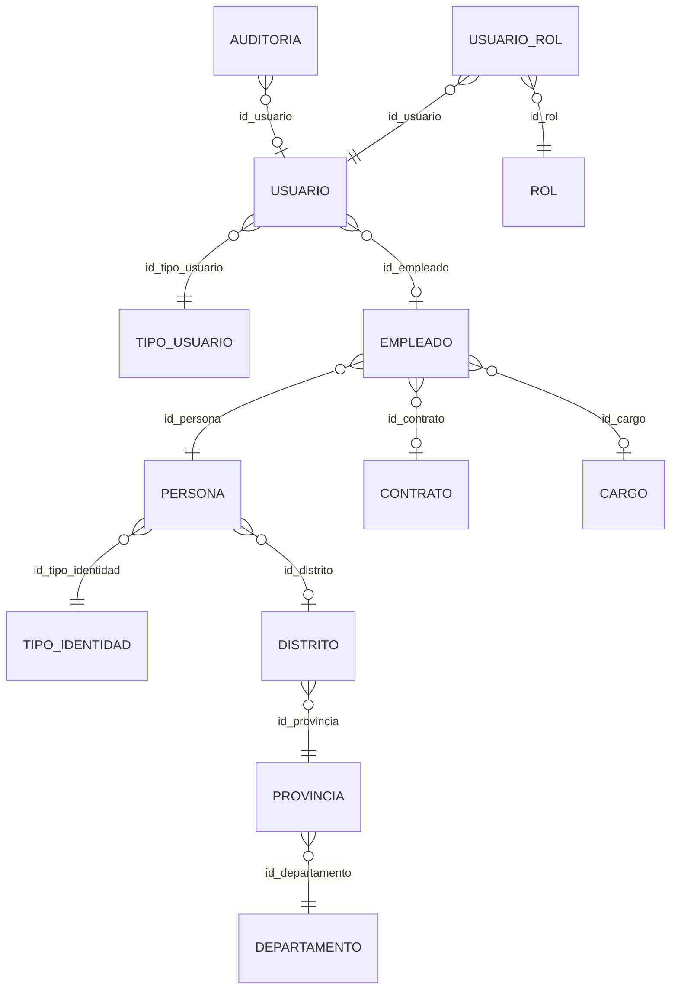

# PLAN: Backend Spring Boot — Entidad `usuario` y su grafo de relaciones

Alcance: la entidad `usuario` y todas las entidades alcanzables desde ella por FK. Base: PostgreSQL, script [bodega.sql](bodega.sql). Se usa `spring.jpa.hibernate.ddl-auto=validate`: nombres de tabla/columna, tipos y nulabilidad deben coincidir exactamente. Pantalla: [seguridad/seguridad.html](seguridad/seguridad.html), pestaña Usuarios.

## 1. Grafo de relaciones

Capas:

| Capa                | Entidades                      | Dirección             |
| ------------------- | ------------------------------ | --------------------- |
| 0                   | `Usuario`                      | raíz                  |
| 1 (salientes)       | `TipoUsuario`, `Empleado`      | `usuario` -> ellas    |
| 2                   | `Persona`, `Contrato`, `Cargo` | `empleado` -> ellas   |
| 3                   | `TipoIdentidad`, `Distrito`    | `persona` -> ellas    |
| 4                   | `Provincia`                    | `distrito` -> ella    |
| 5                   | `Departamento`                 | `provincia` -> ella   |
| Entrantes           | `UsuarioRol`, `Auditoria`      | ellas -> `usuario`    |
| Entrante, 2.º nivel | `Rol`                          | `usuario_rol` -> ella |

## 2. Convenciones comunes

- PK `bigserial` -> `Long` con `@GeneratedValue(strategy = GenerationType.IDENTITY)`. FK `bigint` -> `Long`.
- `timestamp` -> `LocalDateTime`; `date` -> `LocalDate`; `numeric(8,2)` -> `BigDecimal`.
- No hay `char(n)`: todo es `varchar`.
- Todas las tablas incluyen estas columnas (usar `@MappedSuperclass AuditoriaBase`):

| Campo    | Columna   | Tipo                                    | Nulo |
| -------- | --------- | --------------------------------------- | ---- |
| `usuCre` | `usu_cre` | varchar(30)                             | sí   |
| `pcCre`  | `pc_cre`  | varchar(30)                             | sí   |
| `fecCre` | `fec_cre` | timestamp (default `CURRENT_TIMESTAMP`) | sí   |
| `usuMod` | `usu_mod` | varchar(30)                             | sí   |
| `pcMod`  | `pc_mod`  | varchar(30)                             | sí   |
| `fecMod` | `fec_mod` | timestamp                               | sí   |
| `estado` | `estado`  | varchar(1), default `'1'`               | no   |

- `estado`: `'1'` activo, `'0'` inactivo. Desactivar es borrado lógico.
- Todas las relaciones `@ManyToOne` con `FetchType.LAZY`. Exponer solo DTOs, nunca `clave`.
- Con `validate` basta mapear las columnas que se declaren; las no declaradas no se validan. Aun así, las columnas NOT NULL sin default deben mapearse si algún día se inserta desde el backend.

## 3. Entidad raíz

### 3.1 `usuario`

| Campo         | Columna           | Tipo         | Nulo | Notas                                                     |
| ------------- | ----------------- | ------------ | ---- | --------------------------------------------------------- |
| `idUsuario`   | `id_usuario`      | bigserial    | no   | PK                                                        |
| `tipoUsuario` | `id_tipo_usuario` | bigint       | no   | `@ManyToOne` -> `TipoUsuario` (`fk_usuario_tipo_usuario`) |
| `empleado`    | `id_empleado`     | bigint       | sí   | `@ManyToOne` -> `Empleado` (`fk_usuario_empleado`)        |
| `logeo`       | `logeo`           | varchar(30)  | no   | único (`uq_usuario_logeo`)                                |
| `clave`       | `clave`           | varchar(200) | no   | hash BCrypt                                               |

Colección inversa: `@OneToMany(mappedBy = "usuario") List<UsuarioRol> roles`.

Pantalla: Usuario (`logeo`), Empleado (nombre completo vía `empleado.persona`), Roles (vía `usuario_rol` -> `rol.n_rol`), Estado, Fecha creación (`fec_cre`).

## 4. Relaciones salientes (usuario depende de ellas)

### 4.1 `tipo_usuario`

| Campo           | Columna           | Tipo        | Nulo    |
| --------------- | ----------------- | ----------- | ------- |
| `idTipoUsuario` | `id_tipo_usuario` | bigserial   | no (PK) |
| `nTipoUsuario`  | `n_tipo_usuario`  | varchar(50) | no      |

Datos semilla: ADMINISTRADOR, CAJERO, ALMACENERO. Alimenta el select "Tipo de usuario".

### 4.2 `empleado`

| Campo          | Columna         | Tipo         | Nulo | Notas                      |
| -------------- | --------------- | ------------ | ---- | -------------------------- |
| `idEmpleado`   | `id_empleado`   | bigserial    | no   | PK                         |
| `persona`      | `id_persona`    | bigint       | no   | `@ManyToOne` -> `Persona`  |
| `contrato`     | `id_contrato`   | bigint       | sí   | `@ManyToOne` -> `Contrato` |
| `cargo`        | `id_cargo`      | bigint       | sí   | `@ManyToOne` -> `Cargo`    |
| `salario`      | `salario`       | numeric(8,2) | sí   |                            |
| `turno`        | `turno`         | varchar(18)  | sí   |                            |
| `fondoPension` | `fondo_pension` | varchar(3)   | sí   |                            |
| `nHps`         | `n_hps`         | varchar(11)  | sí   |                            |
| `essalud`      | `essalud`       | varchar(6)   | sí   |                            |

### 4.3 `persona`

| Campo           | Columna             | Tipo         | Nulo | Notas                           |
| --------------- | ------------------- | ------------ | ---- | ------------------------------- |
| `idPersona`     | `id_persona`        | bigserial    | no   | PK                              |
| `distrito`      | `id_distrito`       | bigint       | sí   | `@ManyToOne` -> `Distrito`      |
| `tipoIdentidad` | `id_tipo_identidad` | bigint       | no   | `@ManyToOne` -> `TipoIdentidad` |
| `nDocumento`    | `n_documento`       | varchar(15)  | no   |                                 |
| `nombre`        | `nombre`            | varchar(80)  | no   |                                 |
| `apPaterno`     | `ap_paterno`        | varchar(80)  | sí   |                                 |
| `apMaterno`     | `ap_materno`        | varchar(80)  | sí   |                                 |
| `fNacimiento`   | `f_nacimiento`      | date         | sí   |                                 |
| `email`         | `email`             | varchar(50)  | sí   |                                 |
| `celular`       | `celular`           | varchar(9)   | sí   |                                 |
| `genero`        | `genero`            | varchar(1)   | sí   | check: `M`, `F`, `O` o nulo     |
| `direccion`     | `direccion`         | varchar(100) | sí   |                                 |

Nombre completo para la pantalla: `nombre + ap_paterno + ap_materno`.

### 4.4 `contrato`

| Campo        | Columna       | Tipo        | Nulo    |
| ------------ | ------------- | ----------- | ------- |
| `idContrato` | `id_contrato` | bigserial   | no (PK) |
| `nContrato`  | `n_contrato`  | varchar(40) | no      |

### 4.5 `cargo`

| Campo     | Columna    | Tipo        | Nulo    |
| --------- | ---------- | ----------- | ------- |
| `idCargo` | `id_cargo` | bigserial   | no (PK) |
| `nCargo`  | `n_cargo`  | varchar(40) | no      |

### 4.6 `tipo_identidad`

| Campo             | Columna             | Tipo        | Nulo    |
| ----------------- | ------------------- | ----------- | ------- |
| `idTipoIdentidad` | `id_tipo_identidad` | bigserial   | no (PK) |
| `nTipoIdentidad`  | `n_tipo_identidad`  | varchar(20) | no      |
| `abreviatura`     | `abreviatura`       | varchar(10) | sí      |
| `longitud`        | `longitud`          | integer     | sí      |

### 4.7 `distrito`

| Campo        | Columna        | Tipo        | Nulo | Notas                       |
| ------------ | -------------- | ----------- | ---- | --------------------------- |
| `idDistrito` | `id_distrito`  | bigserial   | no   | PK                          |
| `provincia`  | `id_provincia` | bigint      | no   | `@ManyToOne` -> `Provincia` |
| `dDistrito`  | `d_distrito`   | varchar(40) | no   | el prefijo es `d_`, no `n_` |

### 4.8 `provincia`

| Campo          | Columna           | Tipo        | Nulo | Notas                          |
| -------------- | ----------------- | ----------- | ---- | ------------------------------ |
| `idProvincia`  | `id_provincia`    | bigserial   | no   | PK                             |
| `departamento` | `id_departamento` | bigint      | no   | `@ManyToOne` -> `Departamento` |
| `nProvincia`   | `n_provincia`     | varchar(30) | no   |                                |

### 4.9 `departamento`

| Campo            | Columna           | Tipo        | Nulo    |
| ---------------- | ----------------- | ----------- | ------- |
| `idDepartamento` | `id_departamento` | bigserial   | no (PK) |
| `nDepartamento`  | `n_departamento`  | varchar(30) | no      |

## 5. Relaciones entrantes (otras tablas apuntan a usuario)

### 5.1 `usuario_rol`

| Campo          | Columna          | Tipo       | Nulo | Notas                       |
| -------------- | ---------------- | ---------- | ---- | --------------------------- |
| `idUsuarioRol` | `id_usuario_rol` | bigserial  | no   | PK                          |
| `usuario`      | `id_usuario`     | bigint     | no   | `@ManyToOne` -> `Usuario`   |
| `rol`          | `id_rol`         | bigint     | no   | `@ManyToOne` -> `Rol`       |
| `fAsignacion`  | `f_asignacion`   | timestamp  | sí   | default `CURRENT_TIMESTAMP` |
| `vigente`      | `vigente`        | varchar(1) | no   | default `'1'`               |

Único: `(id_usuario, id_rol)` (`uq_usuario_rol`).

### 5.2 `rol`

| Campo         | Columna       | Tipo         | Nulo | Notas                                  |
| ------------- | ------------- | ------------ | ---- | -------------------------------------- |
| `idRol`       | `id_rol`      | bigserial    | no   | PK                                     |
| `nRol`        | `n_rol`       | varchar(50)  | no   | único (`uq_rol_nombre`)                |
| `descripcion` | `descripcion` | varchar(100) | sí   |                                        |
| `nivel`       | `nivel`       | integer      | sí   | 1 Superior, 2 Operativo, 3 Restringido |
| `fCreacion`   | `f_creacion`  | timestamp    | sí   | default `CURRENT_TIMESTAMP`            |

La relación de `rol` con `rol_permiso`, `permiso` y `modulo` pertenece a la pestaña Permisos y no se trabaja en este plan.

### 5.3 `auditoria`

| Campo           | Columna          | Tipo         | Nulo | Notas                     |
| --------------- | ---------------- | ------------ | ---- | ------------------------- |
| `idAuditoria`   | `id_auditoria`   | bigserial    | no   | PK                        |
| `usuario`       | `id_usuario`     | bigint       | sí   | `@ManyToOne` -> `Usuario` |
| `nTabla`        | `n_tabla`        | varchar(50)  | no   |                           |
| `accion`        | `accion`         | varchar(20)  | no   |                           |
| `idRegistro`    | `id_registro`    | bigint       | sí   |                           |
| `valorAnterior` | `valor_anterior` | varchar(500) | sí   |                           |
| `valorNuevo`    | `valor_nuevo`    | varchar(500) | sí   |                           |
| `fEvento`       | `f_evento`       | timestamp    | sí   |                           |
| `ip`            | `ip`             | varchar(20)  | sí   |                           |
| `terminal`      | `terminal`       | varchar(30)  | sí   |                           |

## 6. Tablas que referencian a `usuario` en otros módulos (fuera de alcance)

`apertura_caja` (`id_usuario`, `id_usuario_cierre`), `compra`, `venta`, `pago_cuenta`, `movimiento_inventario` y `movimiento_caja`. No se mapean aquí: la FK vive en esas tablas, así que `Usuario` no necesita conocerlas. Cada módulo agregará su `@ManyToOne` hacia `Usuario` cuando se trabaje.

`persona` también es referenciada por `cliente` y `proveedor` (`id_persona`); mismo criterio.

## 7. Reglas de BD a respetar

- `usp_login(_logeo)` busca por `logeo` con `estado='1'` y hace JOIN `usuario` -> `tipo_usuario` -> `empleado` -> `persona`. Es la referencia del grafo mínimo que el login ya espera.
- `usp_permisos_usuario(_id_usuario)` solo considera `usuario_rol` con `vigente='1'` y `estado='1'`. Desactivar un rol del usuario es `vigente='0'`, no un `DELETE`.
- Desactivar un usuario es `estado='0'`; no se borran filas (hay FK entrantes desde ventas, compras, caja, etc.).

## 8. Orden de creación de entidades (por dependencias)

1. `AuditoriaBase` (`@MappedSuperclass`).
2. Sin dependencias: `Departamento`, `TipoIdentidad`, `Contrato`, `Cargo`, `TipoUsuario`, `Rol`.
3. `Provincia` -> `Distrito`.
4. `Persona` -> `Empleado`.
5. `Usuario` -> `UsuarioRol`, `Auditoria`.

## 9. Verificación

1. Arrancar con `ddl-auto=validate` contra la BD creada por [bodega.sql](bodega.sql): sin errores de columna o tipo.
2. Cargar el usuario `admin` y recorrer `usuario.empleado.persona.distrito.provincia.departamento` sin errores.
3. Crear un usuario con `logeo` duplicado debe fallar por `uq_usuario_logeo`.
4. La respuesta de la lista de usuarios incluye nombre completo y roles, y no incluye `clave`.
